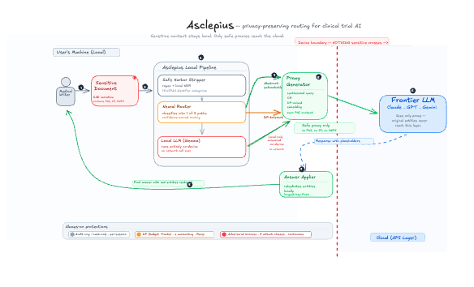

<div align="center">

# GhostDraft

**Clinical privacy workspace — a local proxy layer between sensitive documents and cloud LLMs**

</div>

## How it works



## The problem

Every day, medical writers at pharma companies paste confidential clinical trial documents into cloud LLMs to clean up grammar. Pharmacovigilance specialists draft SAE narratives with patient quasi-identifiers in the prompt. Regulatory affairs teams paste FDA response letters to get help with wording. 58% of front-line health staff use unapproved AI tools for work, and 44% admit to including identifiable patient data at least occasionally.

The existing options are all bad. Block the tools entirely and staff route around you on personal devices. Sign a BAA with an enterprise tier and the sanctioned tools lag in capability, so people still use shadow AI for the hard stuff. Run regex-based DLP and it either over-redacts and destroys clinical meaning, or under-redacts and leaks.

The deeper problem: compliance training focuses on the 18 HIPAA Safe Harbor identifiers — names, SSNs, MRNs — but the most damaging leakage in clinical trials isn't PHI at all. It's Material Non-Public Information: compound codenames that reveal a company's pipeline strategy, interim efficacy readouts that could move stock prices, amendment rationales that signal safety problems before the sponsor announces them. No regex catches *"ORR of 47% in the 200mg arm versus 22% in control."* That's the gap GhostDraft addresses.

## What it does

GhostDraft is a local privacy layer that sits between clinical trial staff and cloud LLMs. It intercepts sensitive documents, processes them through a three-stage pipeline running entirely on-device, and forwards only a safe proxy to the cloud. The response comes back, original entities are re-applied locally, and the user gets a useful answer — without any PHI or proprietary IP ever leaving their machine.

### Pipeline

**1. Safe Harbor Stripper**
Deterministic regex + local NER detection of all 18 HIPAA identifiers, replaced with tagged placeholders like `<PATIENT_NAME_1>`, `<DATE_2>`. The entity map is stored locally and never leaves the process.

**2. Neural Router**
A locally-running model classifies each request into one of three paths:

- **Abstract-extractable** (~70%): task intent can be expressed without any sensitive entities. The local model rewrites the query from scratch. The mapping is non-injective — multiple inputs produce the same synthesized query, making inversion mathematically impossible.
- **DP-tolerant** (~20%): the task needs some content but not exact values. Hidden-state embeddings are clipped to bounded L2 norm and perturbed with calibrated Gaussian noise, providing formal (ε, δ)-differential privacy guarantees.
- **Local-only** (~10%): content and task are inseparable. The local model answers entirely on-device, nothing is sent to the cloud.

**3. Answer Applier**
The cloud response is returned locally, the entity map is re-applied longest-key-first to avoid partial-match collisions, and the final answer is shown to the user.

The DP mechanism uses Rényi DP accounting with per-session budget tracking:

$$\sigma = \frac{\Delta \cdot \sqrt{2 \ln(1.25/\delta)}}{\varepsilon}$$

where Δ = 1.0 (L2 sensitivity after clipping) and δ = 10⁻⁵. At the default ε = 3.0, σ ≈ 1.61. The system hard-refuses when the session privacy budget is exhausted.

Wrapped around the pipeline is a five-attack adversarial harness that measures text-surface privacy directly rather than trusting the mathematical guarantee.

## Architecture

A modular Python pipeline with strict separation of concerns. Every module — Safe Harbor stripper, router, query synthesizer, DP mechanism, proxy decoder, remote client, answer applier — is independently testable. All model calls go through wrappers that enforce audit logging, canary detection, and hash-only output (no raw content in logs).

**Synthetic corpus.** 1,200 structurally realistic clinical trial documents across four types: SAE narratives (500), protocol excerpts (200), CRA monitoring visit reports (200), and Clinical Study Report drafts (300). Every document has ground-truth sensitive-span annotations covering 18 HIPAA categories plus clinical quasi-identifiers and MNPI categories.

**Attack suite.** Five adversarial classes evaluated at every iteration:

- **A1. Verbatim scan** — literal + fuzzy substring matching of ground-truth spans against proxy text
- **A2. Cross-encoder similarity** — cosine similarity via `all-MiniLM-L6-v2`, 0.85 danger threshold
- **A3. Trained span inversion** — DistilBERT token classifier trained to recover sensitive spans from proxy text
- **A4. Membership inference** — logistic regression on proxy embeddings
- **A5. Utility regression** — scoring of proxy-answer quality vs. un-proxied-answer quality on downstream clinical tasks

**Frontend.** A VS Code-style enterprise workspace: three resizable panes, two personas (Analyst for data exploration, Reviewer for safety-narrative drafting), a forensic dock showing live ε accounting and a three-lane view of proxy sent → cloud response → rehydrated answer.

## Key findings

**The embedding–text privacy gap.** We swept ε across {0.5, 1.0, 2.0, 3.0, 5.0} expecting a smooth privacy-utility curve. Instead: utility of exactly 0.8598 at every ε to six decimal places. The σ values ranged from 9.69 to 0.97 — a 10× variation — and the output text was bit-identical.

The root cause: noise is injected correctly into the hidden state, but the proxy decoder ignores it. The decoder projects the noisy vector onto the vocabulary embedding matrix to extract top-k nearest tokens as soft hints, then passes them to a paraphrase prompt that explicitly tells the model hints can be discarded. Under greedy decoding anchored to the placeholder-substituted input, the paraphrase is a deterministic function of the text — not of the hint. The (ε, δ)-DP guarantee holds mathematically on the embedding. It does not propagate to the text surface.

This is not an implementation bug. It's a structural mismatch between where DP is defined (vector representations) and where the adversary operates (token sequences).

**Routing dominates over noise.** The verbatim attack revealed a 3.7× gap in leak rates between the two cloud-using paths on shared quasi-identifier categories. Abstract-extractable achieves 0.00 verbatim rate on efficacy_value; DP-tolerant achieves 0.67 on the same category at the same ε. The DP parameter is identical. Only the routing decision differs.

**The privacy-utility tradeoff is binary, not smooth.** After applying targeted fixes — extended Safe Harbor regex for clinical quasi-identifiers plus a deterministic routing override — 10 of 14 verbatim categories went to 0.0%, verbatim leak rate fell from 76.5% to 7.2%, and utility collapsed from 1.000 to 0.266. The system does not interpolate between the two corners. The router is binary.

**Router fallback is unsafe by default.** 35% of protocol documents triggered a JSON parse error in the routing step, causing silent fallback to DP-tolerant — the weakest privacy path. The system was failing open, not closed.

## What we learned

**Mathematical DP guarantees are not evidence of text-surface privacy.** Vary ε across orders of magnitude and check whether the text actually changes. If it doesn't, the DP mechanism is disconnected from the observable surface. We call this the *ε-invariance check* — a necessary diagnostic for any system in this class.

**DP noise is isotropic; decoder sensitivity is not.** The Gaussian noise we injected was spherical in hidden-state space. The decoder's output is sensitive only to specific directions — those that flip token-selection decisions at some decoding step. Noise energy in the output-invariant subspace is wasted privacy budget. An interpretability-informed DP mechanism would concentrate noise along output-relevant directions.

**The biggest leakage risk in clinical trials isn't PHI — it's IP.** Staff are trained to avoid pasting patient names, but they don't think of compound codenames, interim efficacy data, or amendment rationales as "sensitive." Regex catches SSNs and MRNs; it doesn't catch *"hazard ratio of 0.61 for PFS at the second interim analysis"* — and that's a billion-dollar sentence with no identifiers in it.

## Roadmap

- **Decoder-aware DP** — perturbation along the decoder's output-sensitive directions, informed by mechanistic interpretability
- **Trained privacy decoder** — a seq2seq model trained on (noisy embedding → privacy-preserving text) pairs, so noise becomes a hard conditioning signal
- **Continuous abstraction** — a mechanism that interpolates between paraphrase and query synthesis
- **Content-coupling detection** — router-time classification of whether a task is content-coupled, with explicit UI signaling
- **Constrained-decoding router** — grammar-constrained decoding to eliminate the 35% parse-failure rate and its unsafe fallback
- **Workflow-specific UX** — purpose-built modes for SAE narrative drafting, protocol synopsis editing, monitoring report summarization, CSR section rewriting
- **Enterprise deployment** — hospital or CRO-hosted inference endpoint with centralized audit logging, SSO, and compliance dashboards

## Getting started

```bash
# one-time setup
./scripts/setup.sh
cp .env.example .env   # fill in API keys

# run backend
NGSP_SKIP_LOCAL_MODEL=1 .venv/bin/uvicorn backend.main:app --host 0.0.0.0 --port 8000 --reload

# run frontend
cd frontend && npm install --legacy-peer-deps && npm run dev

# run tests
.venv/bin/pytest -q
```

## Stack

Python · PyTorch · Hugging Face Transformers · sentence-transformers · DistilBERT · Pydantic · FastAPI · React · TypeScript · D3 · Rényi Differential Privacy · HIPAA Safe Harbor · CTCAE · ICH E2A
